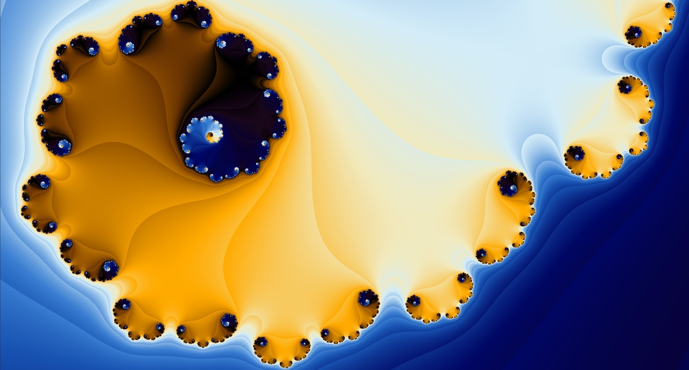
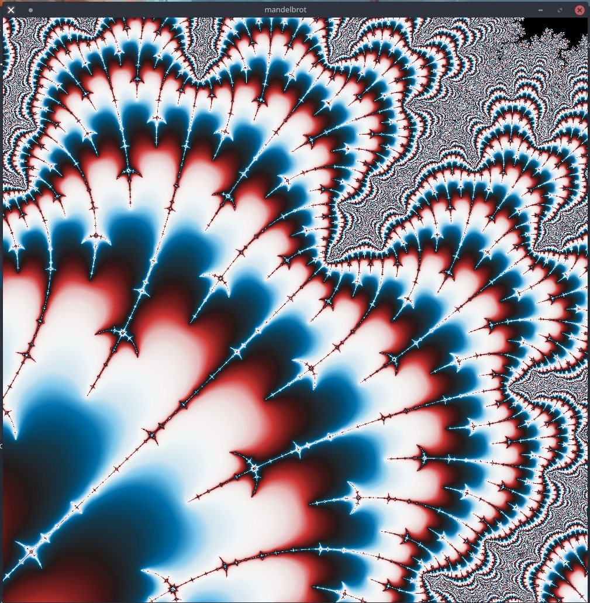
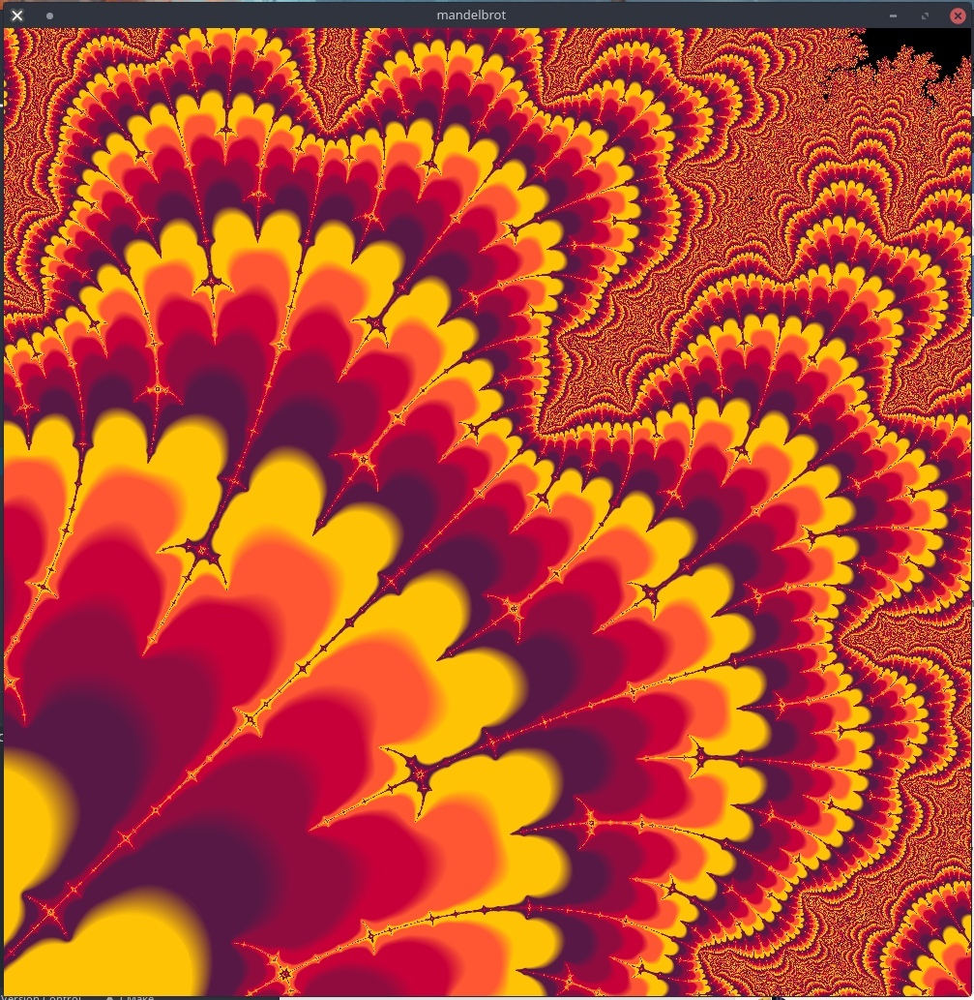
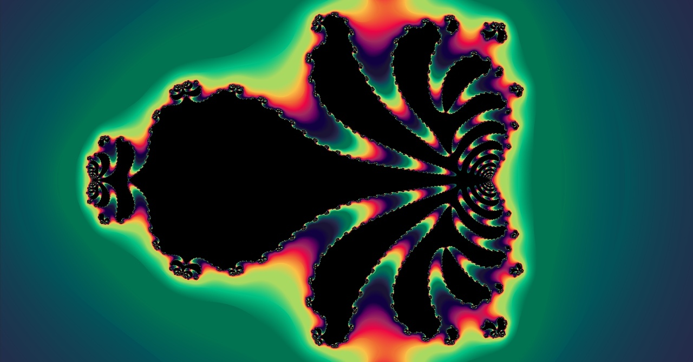

# Fractal drawer
## Description
Fractal drawer using Minilibx and pthread

## Features
1. Multithreaded rendering
2. Zoom (scroll button)
3. Moving (arrow keys)
4. Smooth colors

## Instructions
```
> make
> ./fractol [mandelbrot, biomorph, julia, burningship, frothy, spider, thorn, unknown]
```

# Screenshots





